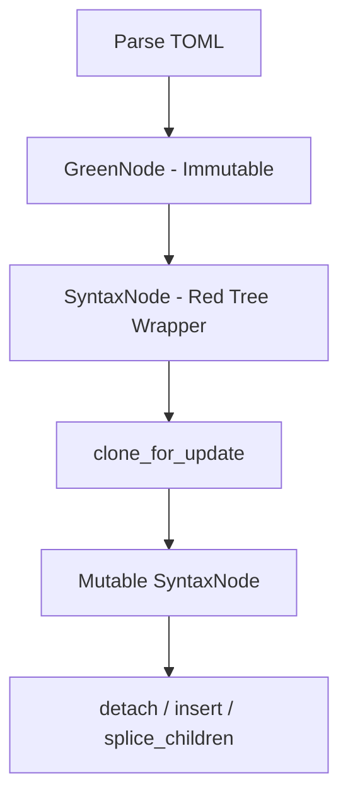

# Contributing to toml-fmt

## Project Layout

This repository is a Cargo workspace containing multiple Rust crates and Python packages that share common TOML
formatting infrastructure. The project follows a layered architecture where low-level TOML manipulation code is shared
across multiple high-level formatter tools.

The workspace is organized into three main packages. At the foundation is `common/`, a pure Rust library that provides
all the core TOML parsing, syntax tree manipulation, and formatting utilities. This crate contains no Python bindings
and serves as the shared infrastructure for all formatters in this repository. On top of common, we have
`pyproject-fmt/`, which is a Python package (with Rust internals via PyO3) that formats `pyproject.toml` files according
to PEP 621 and community standards. It handles project metadata, dependencies, classifiers, and tool-specific
configuration sections. Similarly, `tox-toml-fmt/` is another Python package (also with Rust internals) that formats
`tox.toml` files used by the tox test automation tool.

```
toml-fmt/                       # Workspace root
├── common/                     # Shared Rust library
│   ├── src/
│   │   ├── lib.rs             # Module exports
│   │   ├── create.rs          # Syntax node creation
│   │   ├── string.rs          # String handling
│   │   ├── table.rs           # Table manipulation
│   │   ├── array.rs           # Array operations
│   │   ├── pep508.rs          # PEP 508 dependency parsing
│   │   └── tests/             # Unit tests
│   └── Cargo.toml
├── pyproject-fmt/              # pyproject.toml formatter
│   ├── rust/src/              # Rust implementation
│   │   ├── lib.rs            # PyO3 bindings
│   │   ├── main.rs           # Settings & entry point
│   │   ├── project.rs        # [project] table formatting
│   │   ├── dependency_groups.rs  # PEP 735 dependency groups
│   │   └── tests/            # Rust tests
│   ├── src/pyproject_fmt/    # Python wrapper
│   ├── tests/                # Python integration tests
│   ├── Cargo.toml            # Rust manifest
│   └── pyproject.toml        # Python manifest
└── tox-toml-fmt/              # tox.toml formatter
    ├── rust/src/             # Rust implementation
    ├── src/tox_toml_fmt/     # Python wrapper
    ├── tests/                # Python integration tests
    ├── Cargo.toml
    └── pyproject.toml
```

### Development Commands by Package

When working on this codebase, you'll use different commands depending on which layer you're modifying. The commands are
organized by the package they apply to, with clear separation between Rust and Python tooling.

#### Working on `common/` (Rust library)

The common library contains all the low-level TOML manipulation code. When you modify this package, you're changing
shared infrastructure that affects both pyproject-fmt and tox-toml-fmt. Since this is pure Rust with no Python bindings,
all development happens through Cargo commands.

```bash
# Run all tests in common
cargo test -p common

# Run specific test
cargo test -p common test_load_text

# Check test coverage
cargo llvm-cov -p common --summary-only

# Format code
cargo fmt -p common

# Run linter
cargo clippy -p common
```

#### Working on `pyproject-fmt/` or `tox-toml-fmt/` (Python packages with Rust internals)

These packages have both Rust and Python layers. The Rust layer handles all the actual formatting logic, while the
Python layer provides the CLI interface and higher-level API. When developing these packages, you'll typically modify
Rust code first, then ensure the Python tests still pass.

For Rust layer development:

```bash
# Run Rust tests for pyproject-fmt
cargo test -p pyproject-fmt

# Run Rust tests for tox-toml-fmt
cargo test -p tox-toml-fmt

# Check coverage for pyproject-fmt Rust code
cargo llvm-cov -p pyproject-fmt --summary-only

# Format and lint work the same way
cargo fmt -p pyproject-fmt
cargo clippy -p pyproject-fmt
```

For Python layer development and integration testing, you use tox to manage the development environment and run tests.
The build process compiles the Rust code and creates Python bindings via PyO3, which can take a minute or two on the
first build. After that, cargo caches compiled artifacts and rebuilds are much faster.

```bash
# Set up development environment for pyproject-fmt
cd pyproject-fmt
tox run -e dev

# Run Python tests
tox run -e 3.13

# Run the formatter on a file to test manually
pyproject-fmt path/to/pyproject.toml

# Same commands work for tox-toml-fmt
cd tox-toml-fmt
tox run -e dev
tox run -e 3.13
```

#### Working across the entire workspace

Sometimes you need to run commands across all packages at once. This is especially useful for CI-like validation before
committing or when you've modified common code that affects multiple packages.

```bash
# Run all tests in workspace (common, pyproject-fmt, tox-toml-fmt)
cargo test --workspace

# Check workspace-wide coverage
cargo llvm-cov --workspace --summary-only

# Format all Rust code
cargo fmt --all

# Lint all Rust code
cargo clippy --workspace
```

## Architecture Overview

This project uses taplo for TOML parsing and syntax tree manipulation. Taplo is built on the rowan library, which
provides a lossless syntax tree implementation designed specifically for incremental parsing and efficient tree
modifications.

## Understanding Taplo/Rowan

### Green Tree vs Red Tree

Rowan uses a two-layer tree architecture that separates immutable data from mutable views. The Green layer represents
the immutable, memory-efficient core of the syntax tree. Green nodes have no parent pointers and use structural sharing,
meaning identical subtrees share the same memory. This makes them cheap to clone since they're Arc-based.

The Red layer (SyntaxNode) provides a mutable wrapper around Green nodes. It adds parent pointers for tree traversal and
provides APIs for inserting and deleting nodes. You make a tree mutable by calling `clone_for_update()`, which doesn't
deep-copy the tree but creates a mutable wrapper where changes are tracked incrementally.



### Mutation Model

When you parse TOML, you get an immutable syntax tree. To modify it, you call `clone_for_update()` which creates a
mutable version. From there, you can use methods like `detach()` to remove nodes from their parent, `append_child()` to
add new nodes, or `splice_children()` for batch updates. The key insight is that `clone_for_update()` is efficient
because it doesn't actually copy the entire tree—it creates a mutable wrapper that tracks changes incrementally.

```rust
let syntax = parse(toml_str).into_syntax();
let mutable_tree = syntax.clone_for_update();

entry.detach();  // Remove from parent
parent.append_child(new_node);  // Add child
node.splice_children(range, new_children);  // Batch update
```

### Node Types

The syntax tree consists of tokens (leaf nodes) and composite nodes. Tokens include things like STRING (`"hello"`),
NEWLINE (`\n`), COMMA (`,`), and IDENT (bare identifiers). Composite nodes include ENTRY (a key-value pair), VALUE (the
right side of an assignment), ARRAY (an array of values), TABLE_HEADER (`[section]`), and TABLE_ARRAY_HEADER
(`[[section]]`).

Here's an example showing the structure for a simple TOML entry:

```toml
name = "value"
```

This parses into:

```
ROOT
└─ ENTRY
   ├─ KEY (token): "name "
   ├─ EQ (token): "="
   ├─ WHITESPACE (token): " "
   └─ VALUE (node)
      └─ STRING (token): "\"value\""
```

## Design Decisions

### Why Parse-and-Extract for Node Creation

In `common/src/create.rs`, we use a "parse-and-extract" pattern rather than rowan's `GreenNodeBuilder`. When we need to
create a STRING node, we format a complete TOML expression like `a = "text"`, parse it, navigate to the ENTRY node, find
the VALUE child, and extract the STRING token from within it. While this involves parsing overhead, we chose this
approach for several important reasons.

First, we can't actually create standalone tokens with `GreenNodeBuilder`. The builder creates complete trees with a
root node, so to get a single STRING token, we'd need to wrap it in a root and then navigate to extract it anyway—the
same navigation we do now. Second, we'd need to reimplement all TOML escaping rules (quote escaping, backslash escaping,
newline escaping, unicode sequences `\uXXXX` and `\UXXXXXXXX`, and line continuations) that taplo's parser already
handles correctly. Third, parse-and-extract guarantees we always create valid TOML syntax because we're using the actual
parser. Finally, performance is not a concern here because node creation is a small fraction of total formatting time.

The trade-off is clear: we accept slightly slower node creation in exchange for guaranteed correctness, simpler code,
and better maintainability.

### Why We Don't Use Taplo's DOM API

Taplo provides a DOM (Document Object Model) layer on top of the raw syntax trees. The DOM offers type-safe, semantic
access to TOML structures through types like `Table`, `Array`, and `Str`. You can navigate the DOM structure and read
values in a type-safe way without manual kind checking.

We investigated whether the DOM API could simplify our code for semantic operations like reordering dependencies and
fixing classifiers. Our investigation (documented in `common/src/tests/dom_investigation.rs`) revealed that while the
DOM provides excellent read-only access to TOML semantics, it does not support mutation operations. The `Table` type has
methods like `get()` and `entries()` for reading, but no `insert()`, `remove()`, or `update()` methods for modification.

This means the DOM is designed for semantic reading and validation, not for the kind of structural transformations we
need to perform. We must continue using direct syntax tree manipulation for all mutation operations. However, we could
potentially use the DOM for read-only analysis tasks if we needed type-safe semantic queries in the future.

## Testing Guidelines

### Unit Tests and Parameterization

Each module has corresponding tests in the `src/tests/` directory following a consistent naming pattern. We use the
`rstest` crate for parameterized tests, which allows us to test multiple cases with different inputs using a single test
function. This reduces code duplication and makes it easy to add new test cases.

```rust
#[rstest]
#[case::basic_string("\"hello\"", STRING, "hello")]
#[case::escaped_quote("\"hello \\\"world\\\"\"", STRING, "hello \"world\"")]
fn test_load_text(#[case] input: &str, #[case] kind: SyntaxKind, #[case] expected: &str) {
    assert_eq!(load_text(input, kind), expected);
}
```

### Coverage Goals and Measurement

We aim for at least 95% line coverage on all non-PyO3 code. PyO3 bindings are tested through Python integration tests
rather than Rust unit tests. Use `cargo llvm-cov` to measure coverage, running
`cargo llvm-cov --lcov --output-path /tmp/coverage.lcov` to generate a coverage report and
`cargo llvm-cov report --summary-only` to view the summary.

Some defensive code may not reach 100% coverage, and this is acceptable. For example, `.expect()` calls on
guaranteed-valid input (like "parsed TOML has a child" after we just parsed valid TOML) are defensive programming but
will never actually fail in practice. These defensive assertions help catch bugs during development without needing to
achieve 100% coverage.

### Writing Good Assertions

Write assertions that verify the complete expected output rather than just checking for the presence of substrings. Full
assertions make tests more robust and catch subtle bugs that partial assertions might miss.

Good assertion style uses exact equality checks:

```rust
assert_eq!(result, expected_complete_output);
```

Bad assertion style uses vague substring matching:

```rust
assert!(result.contains("dependencies"));  // Too vague - doesn't verify structure
```

## Common Patterns

### Iterating Over Table Entries

When you need to process entries in a TOML table, use the `Tables` abstraction from `common::table`. This handles the
complexity of navigating the syntax tree and finding entries within a specific table section.

```rust
use common::table::Tables;

let tables = Tables::from_ast(&syntax);
for entry in tables.get("project") {
    if let Some(key) = get_key_name(entry) {
        // Process entry based on key
    }
}
```

### Modifying String Values

To transform string values in TOML (like normalizing dependency versions or fixing URLs), use the `update_content`
function from `common::string`. This handles all the complexity of finding string nodes, applying your transformation,
and updating the tree.

```rust
use common::string::update_content;

update_content(value_node, |text| {
    text.to_lowercase()  // Your transformation function
});
```

### Creating New Nodes

When you need to create new syntax nodes, use the functions in `common::create`. These use the parse-and-extract pattern
to guarantee valid TOML syntax.

```rust
use common::create::{make_string_node, make_entry_of_string};

let new_string = make_string_node("value");
let new_entry = make_entry_of_string(&"key".to_string(), &"value".to_string());
```

## Development Workflow

The typical development workflow starts with making changes in the Rust code, then running the test suite with
`cargo test`. Check coverage using `cargo llvm-cov report` to ensure your changes are well-tested. Format your code with
`cargo fmt` and run the linter with `cargo clippy` to catch common issues.

For testing the Python bindings, first set up the development environment by running `tox run -e dev` in the
`pyproject-fmt` directory. Then run the Python test suite using `tox run -e 3.13` or whichever Python version you're
targeting. This ensures both the Rust and Python layers work correctly together.

When you're ready to commit, make sure all tests pass in both Rust and Python, coverage meets the threshold, and the
code is formatted and lint-free.
