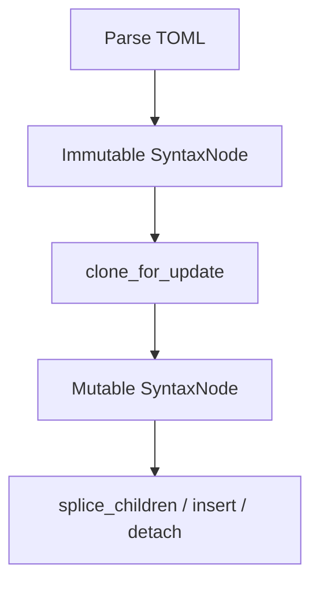

# Contributing to toml-fmt

## Project Layout

This repository is a Cargo workspace containing multiple Rust crates and Python packages that share common TOML
formatting infrastructure. The project follows a layered architecture where low-level TOML manipulation code is shared
across multiple high-level formatter tools.

The workspace is organized into three main packages. At the foundation is `common/`, a pure Rust library that provides
all the core TOML parsing, syntax tree manipulation, and formatting utilities. This crate contains no Python bindings
and serves as the shared infrastructure for all formatters in this repository. On top of common, we have
`pyproject-fmt/`, which is a Python package (with Rust internals via PyO3) that formats `pyproject.toml` files according
to PEP 621 and community standards. It handles project metadata, dependencies, classifiers, and tool-specific
configuration sections. Similarly, `tox-toml-fmt/` is another Python package (also with Rust internals) that formats
`tox.toml` files used by the tox test automation tool.

```
toml-fmt/                       # Workspace root
├── tasks/                      # Development scripts
│   └── generate_readme.py     # Generates README.rst from docs
├── common/                     # Shared Rust library
│   ├── src/
│   │   ├── lib.rs             # Module exports
│   │   ├── create.rs          # Syntax node creation
│   │   ├── string.rs          # String handling
│   │   ├── table.rs           # Table manipulation
│   │   ├── array.rs           # Array operations
│   │   ├── pep508.rs          # PEP 508 dependency parsing
│   │   └── tests/             # Unit tests
│   └── Cargo.toml
├── pyproject-fmt/              # pyproject.toml formatter
│   ├── rust/src/              # Rust implementation
│   │   ├── lib.rs            # PyO3 bindings
│   │   ├── main.rs           # Settings & entry point
│   │   ├── project.rs        # [project] table formatting
│   │   ├── dependency_groups.rs  # PEP 735 dependency groups
│   │   └── tests/            # Rust tests
│   ├── src/pyproject_fmt/    # Python wrapper
│   ├── tests/                # Python integration tests
│   ├── Cargo.toml            # Rust manifest
│   └── pyproject.toml        # Python manifest
└── tox-toml-fmt/              # tox.toml formatter
    ├── rust/src/             # Rust implementation
    ├── src/tox_toml_fmt/     # Python wrapper
    ├── tests/                # Python integration tests
    ├── Cargo.toml
    └── pyproject.toml
```

### Development Commands by Package

When working on this codebase, you'll use different commands depending on which layer you're modifying. The commands are
organized by the package they apply to, with clear separation between Rust and Python tooling.

#### Working on `common/` (Rust library)

The common library contains all the low-level TOML manipulation code. When you modify this package, you're changing
shared infrastructure that affects both pyproject-fmt and tox-toml-fmt. Since this is pure Rust with no Python bindings,
all development happens through Cargo commands.

```bash
# Run all tests in common
cargo test -p common

# Run specific test
cargo test -p common test_load_text

# Check test coverage
cargo llvm-cov -p common --summary-only

# Format code
cargo fmt -p common

# Run linter
cargo clippy -p common
```

#### Working on `pyproject-fmt/` or `tox-toml-fmt/` (Python packages with Rust internals)

These packages have both Rust and Python layers. The Rust layer handles all the actual formatting logic, while the
Python layer provides the CLI interface and higher-level API. When developing these packages, you'll typically modify
Rust code first, then ensure the Python tests still pass.

For Rust layer development:

```bash
# Run Rust tests for pyproject-fmt
cargo test -p pyproject-fmt

# Run Rust tests for tox-toml-fmt
cargo test -p tox-toml-fmt

# Check coverage for pyproject-fmt Rust code
cargo llvm-cov -p pyproject-fmt --summary-only

# Format and lint work the same way
cargo fmt -p pyproject-fmt
cargo clippy -p pyproject-fmt
```

For Python layer development and integration testing, you use tox to manage the development environment and run tests.
The build process compiles the Rust code and creates Python bindings via PyO3, which can take a minute or two on the
first build. After that, cargo caches compiled artifacts and rebuilds are much faster.

```bash
# Set up development environment for pyproject-fmt
cd pyproject-fmt
tox run -e dev

# Run Python tests
tox run -e 3.13

# Run the formatter on a file to test manually
pyproject-fmt path/to/pyproject.toml

# Same commands work for tox-toml-fmt
cd tox-toml-fmt
tox run -e dev
tox run -e 3.13
```

#### Working across the entire workspace

Sometimes you need to run commands across all packages at once. This is especially useful for CI-like validation before
committing or when you've modified common code that affects multiple packages.

```bash
# Run all tests in workspace (common, pyproject-fmt, tox-toml-fmt)
cargo test --workspace

# Check workspace-wide coverage
cargo llvm-cov --workspace --summary-only

# Format all Rust code
cargo fmt --all

# Lint all Rust code
cargo clippy --workspace
```

## Architecture Overview

This project uses tombi for TOML parsing and syntax tree manipulation. Tombi is built on the rg_tree library, which
provides a lossless syntax tree implementation designed for incremental parsing and efficient tree modifications.

## Understanding Tombi/rg_tree

### Syntax Tree Architecture

Tombi uses rg_tree for its AST representation, which provides a mutable syntax tree where nodes can be modified in
place. When you parse TOML with tombi, you get an immutable syntax tree. To modify it, you call `clone_for_update()`
which creates a mutable version that supports structural changes.



### Mutation Model

When you parse TOML, you get an immutable syntax tree. To modify it, you call `clone_for_update()` which creates a
mutable version. From there, you can use methods like `splice_children()` for batch updates, `insert_child()` to add
nodes, or manipulate the tree structure directly. The tree maintains parent-child relationships automatically during
modifications.

```rust
let syntax = tombi_parser::parse(toml_str, TomlVersion::default())
    .syntax_node()
    .clone_for_update();

node.splice_children(range, new_children);  // Batch update
parent.insert_child(index, new_node);       // Insert at position
```

### Node Types and Comment Handling

The syntax tree consists of tokens (leaf nodes) and composite nodes. Tokens include BASIC_STRING (`"hello"`),
LITERAL_STRING (`'hello'`), LINE_BREAK (`\n`), COMMA (`,`), and WHITESPACE. Composite nodes include KEY_VALUE (a
key-value pair), VALUE (the right side of an assignment), ARRAY (an array of values), TABLE (a `[section]` header), and
ARRAY_TABLE (`[[section]]` header).

An important difference from other parsers is how comments are represented. In tombi, inline comments attached to array
elements are children of COMMA nodes. A COMMA node can contain three children: a COMMA token, a WHITESPACE token, and a
COMMENT token. This structure is important when manipulating arrays with comments.

Here's an example showing the structure for a simple TOML entry:

```toml
name = "value"
```

This parses into:

```
ROOT
└─ KEY_VALUE
   ├─ KEY
   │  └─ IDENT (token): "name"
   ├─ WHITESPACE (token): " "
   ├─ EQ (token): "="
   ├─ WHITESPACE (token): " "
   └─ VALUE
      └─ BASIC_STRING (node)
```

For arrays with inline comments, the structure is more complex:

```toml
deps = [
  "pkg", # comment
]
```

This parses into:

```
ROOT
└─ KEY_VALUE
   ├─ KEY
   │  └─ IDENT: "deps"
   └─ VALUE
      └─ ARRAY
         ├─ BRACKET_START: "["
         ├─ LINE_BREAK: "\n"
         ├─ WHITESPACE: "  "
         ├─ BASIC_STRING: "\"pkg\""
         ├─ COMMA (node)
         │  ├─ COMMA (token): ","
         │  ├─ WHITESPACE (token): "  "
         │  └─ COMMENT (token): "# comment"
         ├─ LINE_BREAK: "\n"
         └─ BRACKET_END: "]"
```

## Design Decisions

### Why Parse-and-Extract for Node Creation

In `common/src/create.rs`, we use a "parse-and-extract" pattern. When we need to create a BASIC_STRING node, we format a
complete TOML expression like `a = "text"`, parse it, navigate to the KEY_VALUE node, find the VALUE child, and extract
the BASIC_STRING node from within it. While this involves parsing overhead, we chose this approach for several important
reasons.

First, we'd need to reimplement all TOML escaping rules (quote escaping, backslash escaping, newline escaping, unicode
sequences `\uXXXX` and `\UXXXXXXXX`, and line continuations) that tombi's parser already handles correctly. Second,
parse-and-extract guarantees we always create valid TOML syntax because we're using the actual parser. Finally,
performance is not a concern here because node creation is a small fraction of total formatting time.

The trade-off is clear: we accept slightly slower node creation in exchange for guaranteed correctness, simpler code,
and better maintainability.

## Formatting Style

### Comment Alignment

The formatters implement per-array comment alignment for inline comments. Unlike global alignment where all comments
across the entire file align to the same column, comments are aligned independently within each array based on that
array's longest value. This produces cleaner, more readable formatting.

For example, this input:

```toml
lint.ignore = [
  "COM812", # Conflict with formatter
  "CPY",    # No copyright statements
  "ISC001", # Another long rule
]

lint.per-file-ignores."tests/**/*.py" = [
  "D",    # documentation
  "S101", # asserts
]
```

Will be formatted with each array aligning independently. The `lint.ignore` array aligns based on "ISC001" (its longest
value), while `per-file-ignores` aligns based on "S101". This alignment happens after tombi's primary formatter runs, by
modifying the WHITESPACE children within COMMA nodes that contain COMMENT children.

### Comment Preservation During Sorting

When arrays contain comments (either inline or standalone), sorting is automatically skipped to preserve the comments in
their original positions. This ensures that explanatory comments stay with their associated values. The
`common/src/array.rs::sort()` function checks for comments before sorting and returns early if any are found.

## Testing Guidelines

### Unit Tests and Parameterization

Each module has corresponding tests in the `src/tests/` directory following a consistent naming pattern. We use the
`rstest` crate for parameterized tests, which allows us to test multiple cases with different inputs using a single test
function. This reduces code duplication and makes it easy to add new test cases.

```rust
#[rstest]
#[case::basic_string("\"hello\"", STRING, "hello")]
#[case::escaped_quote("\"hello \\\"world\\\"\"", STRING, "hello \"world\"")]
fn test_load_text(#[case] input: &str, #[case] kind: SyntaxKind, #[case] expected: &str) {
    assert_eq!(load_text(input, kind), expected);
}
```

### Coverage Goals and Measurement

We aim for at least 95% line coverage on all code. Use `cargo llvm-cov` to measure coverage, running
`cargo llvm-cov --lcov --output-path /tmp/coverage.lcov` to generate a coverage report and
`cargo llvm-cov report --summary-only` to view the summary.

#### Testing PyO3 Code from Rust

PyO3 module registration functions (`_lib`) can be tested from Rust by:

1. Adding `pyo3 = { features = ["auto-initialize"] }` to dev-dependencies
1. Running tests with `--no-default-features` to disable `extension-module`
1. Using `pyo3::Python::initialize()` and `pyo3::Python::attach()` to initialize Python

```rust
#[test]
fn test_lib_module_registration() {
    use pyo3::types::PyAnyMethods;

    pyo3::Python::initialize();
    pyo3::Python::attach(|py| {
        let module = pyo3::types::PyModule::new(py, "_lib").unwrap();
        crate::_lib(&module.as_borrowed()).unwrap();

        assert!(module.hasattr("format_toml").unwrap());
        assert!(module.hasattr("Settings").unwrap());
    });
}
```

Run these tests with: `cargo test --no-default-features`

#### LLVM Coverage Artifacts

LLVM coverage reports closing braces of multi-branch conditionals as separate lines. These often show as uncovered even
when all code paths are tested. For example:

```rust
if condition {
    return Some(value);  // covered
}                        // reported as uncovered by LLVM
```

This is a known limitation of LLVM's coverage instrumentation. We do not expect these closing brace lines to be covered
and they should not block merging code that otherwise meets the 95% threshold.

#### Acceptable Coverage Gaps

Some code may not reach 100% coverage, and this is acceptable:

- **Closing braces** in multi-branch conditionals (LLVM coverage artifacts as described above)
- **`.expect()` calls** on guaranteed-valid input (like "parsed TOML has a child" after parsing valid TOML)

### Writing Good Assertions

Write assertions that verify the complete expected output rather than just checking for the presence of substrings. Full
assertions make tests more robust and catch subtle bugs that partial assertions might miss.

Good assertion style uses exact equality checks:

```rust
assert_eq!(result, expected_complete_output);
```

Bad assertion style uses vague substring matching:

```rust
assert!(result.contains("dependencies"));  // Too vague - doesn't verify structure
```

### Snapshot Testing with Insta

For input/output comparison tests (where you verify formatter output against expected results), use the `insta` crate
instead of inline expected strings. This makes test maintenance significantly easier when formatter behavior changes.

Traditional approach (avoid):

```rust
#[rstest]
#[case::simple("input", "expected output")]
fn test_format(#[case] input: &str, #[case] expected: &str) {
    let result = format_toml(input);
    assert_eq!(result, expected);
}
```

Snapshot testing approach (preferred):

```rust
#[rstest]
#[case::simple("input")]
fn test_format(#[case] input: &str) {
    let result = format_toml(input);
    insta::assert_snapshot!(result);
}
```

Snapshot testing workflow:

- Run tests with `cargo insta test` to generate snapshots
- Review changes with `cargo insta review` (interactive) or view diffs manually
- Accept all changes with `cargo insta test --accept`
- Reject changes with `cargo insta reject`

When formatter behavior changes (like switching parsers), you can update all test expectations with a single
`cargo insta test --accept` instead of manually updating hundreds of inline strings. Snapshots are stored in
`src/tests/snapshots/` and committed to git.

## Common Patterns

### Iterating Over Table Entries

When you need to process entries in a TOML table, use the `Tables` abstraction from `common::table`. This handles the
complexity of navigating the syntax tree and finding entries within a specific table section.

```rust
use common::table::Tables;

let tables = Tables::from_ast(&syntax);
for entry in tables.get("project") {
    if let Some(key) = get_key_name(entry) {
        // Process entry based on key
    }
}
```

### Modifying String Values

To transform string values in TOML (like normalizing dependency versions or fixing URLs), use the `update_content`
function from `common::string`. This handles all the complexity of finding string nodes, applying your transformation,
and updating the tree.

```rust
use common::string::update_content;

update_content(value_node, |text| {
    text.to_lowercase()  // Your transformation function
});
```

### Creating New Nodes

When you need to create new syntax nodes, use the functions in `common::create`. These use the parse-and-extract pattern
to guarantee valid TOML syntax.

```rust
use common::create::{make_string_node, make_entry_of_string};

let new_string = make_string_node("value");
let new_entry = make_entry_of_string(&"key".to_string(), &"value".to_string());
```

## Development Workflow

After cloning the repository, you need to generate README.rst files before using maturin or `uv build`. The README.rst
files for PyPI are dynamically generated from docs/index.rst and CHANGELOG.md. Without this step, maturin will fail with
"Failed to read readme... No such file or directory" since pyproject.toml references README.rst.

```bash
# Required once after cloning (generates README.rst files)
cd pyproject-fmt && tox run -e readme
cd tox-toml-fmt && tox run -e readme

# Now maturin/uv build will work
cd pyproject-fmt && uv build .
```

The generated README.rst files are git-ignored and persist until you run `git clean -fdx`. You only need to regenerate
if you modify docs/index.rst or CHANGELOG.md and want the README.rst updated.

The typical development workflow starts with making changes in the Rust code, then running the test suite with
`cargo test`. Check coverage using `cargo llvm-cov report` to ensure your changes are well-tested. Format your code with
`cargo fmt` and run the linter with `cargo clippy` to catch common issues.

For testing the Python bindings, first set up the development environment by running `tox run -e dev` in the
`pyproject-fmt` directory. Then run the Python test suite using `tox run -e 3.13` or whichever Python version you're
targeting. This ensures both the Rust and Python layers work correctly together.

When you're ready to commit, make sure all tests pass in both Rust and Python, coverage meets the threshold, and the
code is formatted and lint-free.
