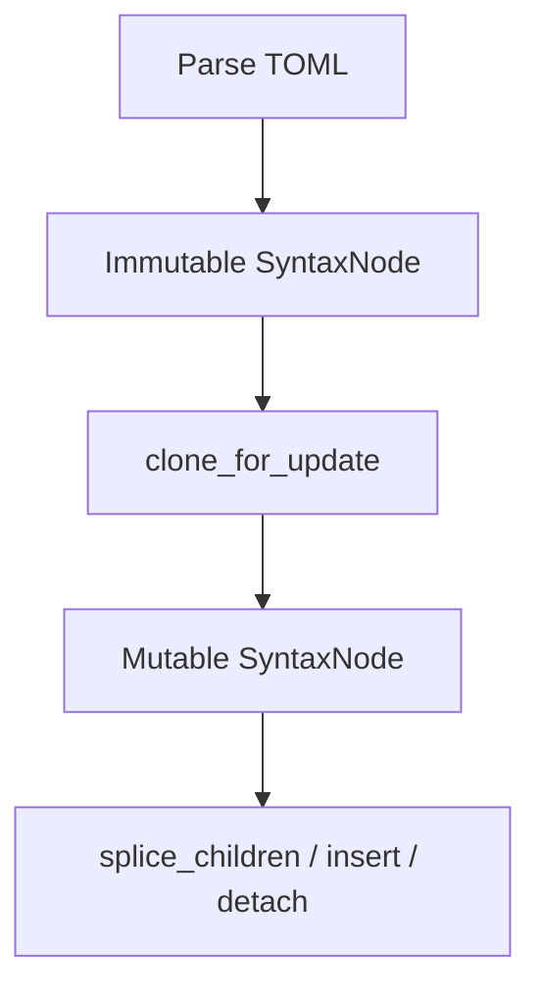

# Contributing to toml-fmt

## Project Layout

This Cargo workspace shares low-level TOML manipulation code across several formatter tools, so a fix in one place
benefits all of them. Four packages make up the workspace:

- `common/`: pure Rust library with the TOML parsing, syntax tree manipulation, and formatting utilities. No Python
  bindings; every formatter here builds on it.
- `toml-fmt-common/`: pure Python library with the CLI utilities, argument parsing, and diff output shared by the Python
  formatters.
- `pyproject-fmt/`: Python package with Rust internals (via PyO3) that formats `pyproject.toml` per PEP 621 and
  community conventions, covering project metadata, dependencies, classifiers, and tool sections.
- `tox-toml-fmt/`: Python package, also Rust-backed, that formats the `tox.toml` files used by tox.

```
toml-fmt/                       # Workspace root
├── tasks/                      # Development scripts
│   └── generate_readme.py     # Generates README.rst from docs
├── common/                     # Shared Rust library
│   ├── src/
│   │   ├── lib.rs             # Module exports
│   │   ├── create.rs          # Syntax node creation
│   │   ├── string.rs          # String handling
│   │   ├── table.rs           # Table manipulation
│   │   ├── array.rs           # Array operations
│   │   ├── pep508.rs          # PEP 508 dependency parsing
│   │   └── tests/             # Unit tests
│   └── Cargo.toml
├── toml-fmt-common/            # Shared Python library
│   ├── src/toml_fmt_common/   # CLI utilities, arg parsing, diff output
│   ├── tests/                 # Python tests
│   └── pyproject.toml
├── pyproject-fmt/              # pyproject.toml formatter
│   ├── rust/src/              # Rust implementation
│   │   ├── lib.rs            # PyO3 bindings
│   │   ├── main.rs           # Settings & entry point
│   │   ├── project.rs        # [project] table formatting
│   │   ├── dependency_groups.rs  # PEP 735 dependency groups
│   │   └── tests/            # Rust tests
│   ├── src/pyproject_fmt/    # Python wrapper
│   ├── tests/                # Python integration tests
│   ├── Cargo.toml            # Rust manifest
│   └── pyproject.toml        # Python manifest
└── tox-toml-fmt/              # tox.toml formatter
    ├── rust/src/             # Rust implementation
    ├── src/tox_toml_fmt/     # Python wrapper
    ├── tests/                # Python integration tests
    ├── Cargo.toml
    └── pyproject.toml
```

### Development Commands by Package

Which commands you run depends on the layer you touch. They split along Rust versus Python tooling.

#### Working on `common/` (Rust library)

Changes here ripple into both pyproject-fmt and tox-toml-fmt, since they share this code. It is pure Rust, so use Cargo
for everything.

```bash
# Run all tests in common
cargo test -p common

# Run specific test
cargo test -p common test_load_text

# Check test coverage
cargo llvm-cov -p common --summary-only

# Format code
cargo fmt -p common

# Run linter
cargo clippy -p common
```

#### Working on `toml-fmt-common/` (Python library)

This package has no Rust code, so development is Python testing with tox.

```bash
# Set up development environment
cd toml-fmt-common
tox run -e dev

# Run tests
tox run -e 3.13

# Run type checking
tox run -e type
```

#### Working on `pyproject-fmt/` or `tox-toml-fmt/` (Python packages with Rust internals)

The Rust layer holds the formatting logic; the Python layer is the CLI and higher-level API. Modify the Rust code first,
then confirm the Python tests still pass.

For Rust layer development:

```bash
# Run Rust tests for pyproject-fmt
cargo test -p pyproject-fmt

# Run Rust tests for tox-toml-fmt
cargo test -p tox-toml-fmt

# Check coverage for pyproject-fmt Rust code
cargo llvm-cov -p pyproject-fmt --summary-only

# Format and lint work the same way
cargo fmt -p pyproject-fmt
cargo clippy -p pyproject-fmt
```

For the Python layer and integration testing, tox manages the environment and runs tests. The first build compiles the
Rust code and generates PyO3 bindings, which takes a minute or two; later rebuilds reuse cargo's cached artifacts.

```bash
# Set up development environment for pyproject-fmt
cd pyproject-fmt
tox run -e dev

# Run Python tests
tox run -e 3.13

# Run the formatter on a file to test manually
pyproject-fmt path/to/pyproject.toml

# Same commands work for tox-toml-fmt
cd tox-toml-fmt
tox run -e dev
tox run -e 3.13
```

#### Working across the entire workspace

Run commands across all packages for CI-like validation before committing, or after changing common code that several
packages depend on.

**Important:** The CI runs tests with `--no-default-features` to disable the PyO3 `extension-module` feature, which
allows tests to link against Python. Always use this flag when running workspace-wide tests locally to match CI
behavior.

```bash
# Run all tests in workspace (common, pyproject-fmt, tox-toml-fmt)
cargo test --workspace --no-default-features

# Check workspace-wide coverage
cargo llvm-cov --workspace --no-default-features --summary-only

# Format all Rust code
cargo fmt --all

# Lint all Rust code
cargo clippy --workspace
```

## Architecture Overview

This project parses and manipulates TOML with tombi, which builds on rg_tree, a lossless syntax tree built for
incremental parsing and in-place tree edits.

## Understanding Tombi/rg_tree

### Syntax Tree Architecture

Parsing TOML with tombi gives you an immutable syntax tree. To modify it, call `clone_for_update()` for a mutable
version that supports structural changes.


```mermaid
graph TD
    A[Parse TOML] --> B[Immutable SyntaxNode]
    B --> C[clone_for_update]
    C --> D[Mutable SyntaxNode]
    D --> E[splice_children / insert / detach]
```

### Mutation Model

On the mutable tree, use `splice_children()` for batch updates, `insert_child()` to add nodes, or edit the structure
directly. The tree keeps parent-child relationships in sync as you go.

```rust
let syntax = tombi_parser::parse(toml_str)
    .syntax_node()
    .clone_for_update();

node.splice_children(range, new_children);  // Batch update
parent.insert_child(index, new_node);       // Insert at position
```

### Node Types and Comment Handling

The syntax tree consists of tokens (leaf nodes) and composite nodes. Tokens include BASIC_STRING (`"hello"`),
LITERAL_STRING (`'hello'`), LINE_BREAK (`\n`), COMMA (`,`), and WHITESPACE. Composite nodes include KEY_VALUE (a
key-value pair), VALUE (the right side of an assignment), ARRAY (an array of values), TABLE (a `[section]` header), and
ARRAY_TABLE (`[[section]]` header).

Tombi represents comments differently from most parsers: an inline comment attached to an array element is a child of
the COMMA node. A COMMA node can hold three children: a COMMA token, a WHITESPACE token, and a COMMENT token. Watch for
this when manipulating arrays with comments.

The structure of a simple TOML entry:

```toml
name = "value"
```

This parses into:

```
ROOT
└─ KEY_VALUE
   ├─ KEY
   │  └─ IDENT (token): "name"
   ├─ WHITESPACE (token): " "
   ├─ EQ (token): "="
   ├─ WHITESPACE (token): " "
   └─ VALUE
      └─ BASIC_STRING (node)
```

An array with inline comments nests deeper:

```toml
deps = [
  "pkg", # comment
]
```

This parses into:

```
ROOT
└─ KEY_VALUE
   ├─ KEY
   │  └─ IDENT: "deps"
   └─ VALUE
      └─ ARRAY
         ├─ BRACKET_START: "["
         ├─ LINE_BREAK: "\n"
         ├─ WHITESPACE: "  "
         ├─ BASIC_STRING: "\"pkg\""
         ├─ COMMA (node)
         │  ├─ COMMA (token): ","
         │  ├─ WHITESPACE (token): "  "
         │  └─ COMMENT (token): "# comment"
         ├─ LINE_BREAK: "\n"
         └─ BRACKET_END: "]"
```

## Design Decisions

### Why Parse-and-Extract for Node Creation

`common/src/create.rs` uses a "parse-and-extract" pattern. To create a BASIC_STRING node, it formats a complete TOML
expression like `a = "text"`, parses it, navigates to the KEY_VALUE node, finds the VALUE child, and extracts the
BASIC_STRING node from within. Three reasons justify the parsing overhead:

- Building nodes by hand means reimplementing every TOML escaping rule (quote, backslash, and newline escaping, the
  unicode sequences `\uXXXX` and `\UXXXXXXXX`, line continuations) that tombi's parser already gets right.
- Going through the real parser guarantees the output is valid TOML.
- Node creation is a tiny fraction of total formatting time, so the extra parse costs nothing that matters.

The trade is slightly slower node creation for guaranteed correctness and simpler code.

## Formatting Style

### Comment Alignment

Inline comments align per array, each to that array's longest value, rather than to one shared column across the whole
file. Keeping alignment local means an outlier in one array does not push every other comment across the file.

For example, this input:

```toml
lint.ignore = [
  "COM812", # Conflict with formatter
  "CPY",    # No copyright statements
  "ISC001", # Another long rule
]

lint.per-file-ignores."tests/**/*.py" = [
  "D",    # documentation
  "S101", # asserts
]
```

aligns each array on its own. `lint.ignore` aligns to "ISC001" (its longest value), `per-file-ignores` to "S101".
Alignment runs after tombi's primary formatter, editing the WHITESPACE children of COMMA nodes that contain a COMMENT
child.

### Comment Preservation During Sorting

When an array contains comments (inline or standalone), sorting is skipped so the comments keep their positions and stay
with the values they explain. `common/src/array.rs::sort()` checks for comments first and returns early if it finds any.

## Testing Guidelines

### Unit Tests and Parameterization

Each module has matching tests in `src/tests/` under a consistent naming pattern. The `rstest` crate drives
parameterized tests, so one test function covers many input cases and adding a case is a single line.

```rust
#[rstest]
#[case::basic_string("\"hello\"", STRING, "hello")]
#[case::escaped_quote("\"hello \\\"world\\\"\"", STRING, "hello \"world\"")]
fn test_load_text(#[case] input: &str, #[case] kind: SyntaxKind, #[case] expected: &str) {
    assert_eq!(load_text(input, kind), expected);
}
```

### Coverage Goals and Measurement

We require **98% line coverage for Rust code** and **100% coverage for Python code**. Diff coverage must also be **100%
per test suite**: changes to `common/src/` must be fully covered by the common test suite alone, and changes to
`tox-toml-fmt/rust/src/` by the tox-toml-fmt test suite alone. Verify with a per-package check:
`cargo llvm-cov -p common --summary-only` or `cargo llvm-cov -p tox-toml-fmt --summary-only`.

For an HTML coverage report, run `tox r -e coverage` from the repository root; it writes lcov output and opens the
report in your browser. For a quick summary, use `cargo llvm-cov --workspace --no-default-features --summary-only`.

#### Testing PyO3 Code from Rust

PyO3 module registration functions (`_lib`) can be tested from Rust by:

1. Adding `pyo3 = { features = ["auto-initialize"] }` to dev-dependencies
1. Running tests with `--no-default-features` to disable `extension-module`
1. Using `pyo3::Python::initialize()` and `pyo3::Python::attach()` to initialize Python

```rust
#[test]
fn test_lib_module_registration() {
    use pyo3::types::PyAnyMethods;

    pyo3::Python::initialize();
    pyo3::Python::attach(|py| {
        let module = pyo3::types::PyModule::new(py, "_lib").unwrap();
        crate::_lib(&module.as_borrowed()).unwrap();

        assert!(module.hasattr("format_toml").unwrap());
        assert!(module.hasattr("Settings").unwrap());
    });
}
```

Run these tests with: `cargo test --no-default-features`

#### LLVM Coverage Artifacts

LLVM reports the closing brace of a multi-branch conditional as its own line, often flagged uncovered even when every
path is tested. For example:

```rust
if condition {
    return Some(value);  // covered
}                        // reported as uncovered by LLVM
```

This is a known limitation of LLVM's coverage instrumentation. These closing-brace lines need not be covered and should
not block merging code that otherwise meets the 98% threshold.

#### Acceptable Coverage Gaps

Some code may not reach 100% coverage, and this is acceptable:

- **Closing braces** in multi-branch conditionals (LLVM coverage artifacts as described above)
- **`.expect()` calls** on guaranteed-valid input (like "parsed TOML has a child" after parsing valid TOML)

### Writing Good Assertions

Assert the complete expected output instead of checking for a substring. A full assertion catches subtle structural bugs
a substring check slides past.

Good assertion style uses exact equality checks:

```rust
assert_eq!(result, expected_complete_output);
```

Bad assertion style uses vague substring matching:

```rust
assert!(result.contains("dependencies"));  // Too vague - doesn't verify structure
```

### Snapshot Testing with Insta

For input/output comparison tests that check formatter output against expected results, use the `insta` crate rather
than inline expected strings, so a behavior change updates expectations in one command instead of by hand.

Traditional approach (avoid):

```rust
#[rstest]
#[case::simple("input", "expected output")]
fn test_format(#[case] input: &str, #[case] expected: &str) {
    let result = format_toml(input);
    assert_eq!(result, expected);
}
```

Snapshot testing approach (preferred, using inline snapshots):

```rust
#[rstest]
#[case::simple("input")]
fn test_format(#[case] input: &str) {
    let result = format_toml(input);
    insta::assert_snapshot!(result, @"");
}
```

The `@""` syntax stores the expected value as an **inline snapshot** in the test file itself. Keeping output next to
input beats file-based snapshots for reading and reviewing tests.

Snapshot testing workflow:

- Run tests with `cargo insta test --accept` to populate inline snapshots
- Review changes with `cargo insta review` (interactive) or view diffs in the test file directly
- Accept all changes with `cargo insta test --accept`
- Reject changes with `cargo insta reject`

When formatter behavior changes (like switching parsers), you can update all test expectations with a single
`cargo insta test --accept` instead of manually updating hundreds of inline strings.

## Common Patterns

### Iterating Over Table Entries

To process entries in a TOML table, use the `Tables` abstraction from `common::table`. It navigates the syntax tree and
finds the entries within a given table section for you.

```rust
use common::table::Tables;

let tables = Tables::from_ast(&syntax);
for entry in tables.get("project") {
    if let Some(key) = get_key_name(entry) {
        // Process entry based on key
    }
}
```

### Modifying String Values

To transform string values in TOML (normalizing dependency versions, fixing URLs), use `update_content` from
`common::string`. It finds the string node, applies your transformation, and updates the tree.

```rust
use common::string::update_content;

update_content(value_node, |text| {
    text.to_lowercase()  // Your transformation function
});
```

### Reordering Inline Table Keys

To enforce a consistent key order within inline tables, use `InlineTableSchema` and `reorder_inline_table_keys` from
`common::table`. Each schema names a discriminator key (which selects the schema) and the desired key order; keys not
listed are appended at the end.

```rust
use common::table::{reorder_inline_table_keys, InlineTableSchema};

const SCHEMAS: &[InlineTableSchema] = &[
    InlineTableSchema {
        discriminator: "replace",
        key_order: &["replace", "default", "extend"],
    },
];

reorder_inline_table_keys(&root_ast, SCHEMAS);
```

### Creating New Nodes

To create new syntax nodes, use the functions in `common::create`. They use the parse-and-extract pattern to guarantee
valid TOML syntax.

```rust
use common::create::{make_string_node, make_entry_of_string};

let new_string = make_string_node("value");
let new_entry = make_entry_of_string(&"key".to_string(), &"value".to_string());
```

## Development Workflow

Change the Rust code, then run the test suite with `cargo test`. Check coverage with `cargo llvm-cov report`. Format
with `cargo fmt` and lint with `cargo clippy`.

To test the Python bindings, set up the environment with `tox run -e dev` in the `pyproject-fmt` directory, then run the
Python suite with `tox run -e 3.13` (or your target Python version) to exercise the Rust and Python layers together.

Before committing, confirm all Rust and Python tests pass, coverage meets the threshold, and the code is formatted and
lint-free.
