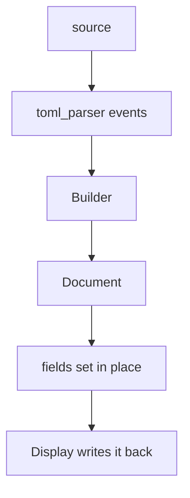

# Contributing to toml-fmt

## Project Layout

This repository shares low-level TOML manipulation code across several formatter tools, so a fix in one place benefits
all of them. Four Rust packages make up the Cargo workspace, beside one Python distribution:

- `toml-doc/`: pure Rust library holding the TOML document model: a format-preserving parse tree with a mutation API. It
  depends on nothing in this workspace and is meant to be extractable.
- `common/`: pure Rust library with the formatting passes built on `toml-doc`. No Python bindings; every formatter here
  builds on it.
- `toml-fmt-common/`: pure Python library with the CLI utilities, argument parsing, and diff output shared by the Python
  formatters.
- `pyproject-fmt/`: Python package with Rust internals (via PyO3) that formats `pyproject.toml` per PEP 621 and
  community conventions, covering project metadata, dependencies, classifiers, and tool sections.
- `tox-toml-fmt/`: Python package, also Rust-backed, that formats the `tox.toml` files used by tox.

```
toml-fmt/                       # Workspace root
├── tasks/                      # Development scripts
│   └── generate_readme.py     # Generates README.rst from docs
├── toml-doc/                   # TOML document model
│   ├── src/
│   │   ├── lib.rs             # parse() and the error type
│   │   ├── build.rs           # events to document
│   │   ├── document.rs        # entries, headers, sections
│   │   ├── value.rs           # keys, values, members
│   │   ├── text.rs            # decoding and encoding
│   │   ├── validate.rs        # what a parsed document has to say to be one
│   │   └── trivia.rs          # whitespace, comments, line breaks
│   ├── tests/                 # round-trip and toml-test compliance
│   └── Cargo.toml
├── common/                     # Shared Rust library
│   ├── src/
│   │   ├── lib.rs             # Module exports
│   │   ├── layout.rs          # whitespace and line breaking
│   │   ├── sections.rs        # finding tables, ordering keys
│   │   ├── arrays.rs          # ordering and rewriting members
│   │   ├── strings.rs         # rewriting values, wrapping
│   │   ├── nesting.rs         # collapsing and expanding tables
│   │   ├── spacing.rs         # empty lines between tables
│   │   ├── build.rs           # making entries and sections
│   │   ├── disabled.rs        # commented-out keys
│   │   ├── pep508.rs          # PEP 508 dependency parsing
│   │   └── group.rs           # `# Group:` markers
│   ├── tests/                 # Unit tests, one file per pass
│   └── Cargo.toml
├── toml-fmt-common/            # Shared Python library
│   ├── src/toml_fmt_common/   # CLI utilities, arg parsing, diff output
│   ├── tests/                 # Python tests
│   └── pyproject.toml
├── pyproject-fmt/              # pyproject.toml formatter
│   ├── rust/src/              # Rust implementation
│   │   ├── lib.rs            # PyO3 bindings
│   │   ├── main.rs           # Settings & entry point
│   │   ├── project.rs        # [project] table formatting
│   │   ├── dependency_groups.rs  # PEP 735 dependency groups
│   │   └── tests/            # Rust tests
│   ├── src/pyproject_fmt/    # Python wrapper
│   ├── tests/                # Python integration tests
│   ├── Cargo.toml            # Rust manifest
│   └── pyproject.toml        # Python manifest
└── tox-toml-fmt/              # tox.toml formatter
    ├── rust/src/             # Rust implementation
    ├── src/tox_toml_fmt/     # Python wrapper
    ├── tests/                # Python integration tests
    ├── Cargo.toml
    └── pyproject.toml
```

### Development Commands by Package

Which commands you run depends on the layer you touch. They split along Rust versus Python tooling.

#### Working on `common/` (Rust library)

Changes here ripple into both pyproject-fmt and tox-toml-fmt, since they share this code. It is pure Rust, so use Cargo
for everything.

```bash
# Run all tests in common
cargo test -p common

# Run specific test
cargo test -p common test_load_text

# Check test coverage
cargo llvm-cov -p common --summary-only

# Format code
cargo fmt -p common

# Run linter
cargo clippy -p common
```

#### Working on `toml-fmt-common/` (Python library)

This package has no Rust code, so development is Python testing with tox.

```bash
# Set up development environment
cd toml-fmt-common
tox run -e dev

# Run tests
tox run -e 3.13

# Run type checking
tox run -e type
```

#### Working on `pyproject-fmt/` or `tox-toml-fmt/` (Python packages with Rust internals)

The Rust layer holds the formatting logic; the Python layer is the CLI and higher-level API. Modify the Rust code first,
then confirm the Python tests still pass.

For Rust layer development:

```bash
# Run Rust tests for pyproject-fmt
cargo test -p pyproject-fmt

# Run Rust tests for tox-toml-fmt
cargo test -p tox-toml-fmt

# Check coverage for pyproject-fmt Rust code
cargo llvm-cov -p pyproject-fmt --summary-only

# Format and lint work the same way
cargo fmt -p pyproject-fmt
cargo clippy -p pyproject-fmt
```

For the Python layer and integration testing, tox manages the environment and runs tests. The first build compiles the
Rust code and generates PyO3 bindings, which takes a minute or two; later rebuilds reuse cargo's cached artifacts.

```bash
# Set up development environment for pyproject-fmt
cd pyproject-fmt
tox run -e dev

# Run Python tests
tox run -e 3.13

# Run the formatter on a file to test manually
pyproject-fmt path/to/pyproject.toml

# Same commands work for tox-toml-fmt
cd tox-toml-fmt
tox run -e dev
tox run -e 3.13
```

#### Working across the entire workspace

Run commands across all packages for CI-like validation before committing, or after changing common code that several
packages depend on.

**Important:** The CI runs tests with `--no-default-features` to disable the PyO3 `extension-module` feature, which
allows tests to link against Python. Always use this flag when running workspace-wide tests locally to match CI
behavior.

```bash
# Run all tests in workspace (toml-doc, common, pyproject-fmt, tox-toml-fmt)
cargo test --workspace --no-default-features

# Check workspace-wide coverage
cargo llvm-cov --workspace --no-default-features --summary-only

# Format all Rust code
cargo fmt --all

# Lint all Rust code
cargo clippy --workspace
```

## Architecture Overview

Formatting runs in two layers. `toml-doc` parses a file into a document that writes back byte for byte, and `common`
walks that document setting the fields that decide how it reads.

## Understanding toml-doc

### The document model

`toml_doc::parse` returns a `Document`: root entries written before the first header, then a `Section` per header, then
whatever trailing lines no item can claim. A `Section` owns its `Header` and the entries under it, which makes it the
unit that moves when tables are reordered.

Every unchanged run of text borrows from the source as a `Cow`, so parsing allocates for structure alone and a value
only becomes owned once something rewrites it.


```mermaid
graph TD
    A[source] --> B[toml_parser events]
    B --> C[Builder]
    C --> D[Document]
    D --> E[fields set in place]
    E --> F[Display writes it back]
```

### Where trivia lives

Comments and blank lines lead the item below them. Reordering carries them along, so no pass has to work out which entry
a comment belonged to:

```rust
let mut document = toml_doc::parse(source).unwrap();
// a section carries the comments written above its header
common::sections::reorder_within(&mut document, &["build-system", "project"], &[], &|_| None);
```

A section is not always a unit that can be moved on its own: a `[fruit.physical]` header written after `[[fruit]]`
belongs to the array element above it. `reorder_within` moves whole blocks for that reason, so reach for it rather than
reordering `document.sections` yourself.

A `Trivia` is a sequence of `Piece::Blank` and `Piece::Comment` lines, which is what `limit_blank_runs` needs. Inside an
array or inline table the container rather than the line start decides the layout, so those runs are a `Padding` of
`Pad::Space`, `Pad::Comment` and `Pad::Newline` instead.

### The container writes the commas

A `Member` holds the spacing on either side of the comma that follows it, and so the comment that closes its line, but
not the comma itself:

```rust
pub struct Member<'a, T> {
    pub lead: Padding<'a>,   // what leads the member
    pub item: T,
    pub trail: Padding<'a>,  // between the member and the comma that follows it
    pub after: Padding<'a>,  // what follows that comma on the same line
}
```

A comma sits between members wherever they end up, so the array or inline table is what writes one out, and a single
`trailing_comma` on the container says whether one closes the last member, which is how a file says it means to stay
open. Sorting an array is therefore an ordinary `Vec` sort, and a comment closing a member's line travels with that
member rather than landing on whoever ends up above it. Removing the last member leaves that trailing comma where the
file put it, so an array written open stays open.

## Design Decisions

### Why a document model of our own

The formatter needs to reorder tables, keys and array members while keeping every byte it did not change, which asks for
a mutable tree. tombi 1.5 dropped the mutable half of its tree, and `toml_edit` models a TOML value rather than the
lines a formatter edits. `toml-doc` sits on `toml_parser`'s event stream, which tracks TOML 1.1.0 and covers every byte,
and owns the model above it.

### Why keys read back without a `Result`

`Key::path` and `Key::segments` decode a key's segments and return them, without a `Result` to unwrap at 57 call sites.
Parsing validates every key it accepts and `Key::new` quotes what needs quoting, so only a hand-built `Repr` can carry
text that is not a valid key; that case panics.

Use `segments` wherever a dot matters. `path` joins with `.`, so a quoted segment holding a dot reads back as two.

## Formatting Style

### Comment Alignment

Inline comments align per array, each to that array's longest value, rather than to one shared column across the whole
file. Keeping alignment local means an outlier in one array does not push every other comment across the file.

For example, this input:

```toml
lint.ignore = [
  "COM812", # Conflict with formatter
  "CPY",    # No copyright statements
  "ISC001", # Another long rule
]

lint.per-file-ignores."tests/**/*.py" = [
  "D",    # documentation
  "S101", # asserts
]
```

aligns each array on its own. `lint.ignore` aligns to "ISC001" (its longest value), `per-file-ignores` to "S101".
`common::layout::align_array_comments` runs after the layout pass and widens the spacing each comment opens with. The
column comes from what the values stand for rather than from how many escapes they are written with, so an escaped value
does not push the column out.

### Comments and Sorting

Sorting reorders arrays that hold comments. A comment above a member leads that member and moves with it; a comment
closing a member's line sits in that member's `after` and moves with it too. A `# Group:` marker splits an array or a
table into blocks that sort on their own, so a file can hold a boundary that sorting must not cross.

A member the key function cannot read has nothing to sort by, so it travels with the member written under it, and a run
of them at the end of a block stays where it is.

## Testing Guidelines

### Where the tests live

`toml-doc` and `common` are libraries, so their tests sit in `tests/` and reach them through the public API alone, one
file per module. The two formatters keep theirs in `rust/src/tests/`, one file per tool, because a tool module is
internal to its crate.

Name a test after the behavior it pins rather than after the function it calls, so a failure reads as a sentence:
`a_trailing_comma_holds_the_array_open_across_a_sort` beats `test_sort_2`.

### Coverage Goals and Measurement

We require **100% line coverage for Rust code** and **100% coverage for Python code**, per package rather than across
the workspace. The common test suite alone has to cover a change to `common/src/`, and the tox-toml-fmt suite alone a
change to `tox-toml-fmt/rust/src/`. That is how each CI job measures it. Verify with
`cargo llvm-cov -p common --summary-only` or `cargo llvm-cov -p tox-toml-fmt --no-default-features --summary-only`.

Coverage data carries over between runs, so after editing a file run `cargo llvm-cov clean --workspace` before measuring
or the line numbers will not line up with the source.

For an HTML report, run `tox r -e coverage` from the repository root; it writes lcov output and opens the report in your
browser.

A branch that cannot run is dead code. Delete it rather than covering it: if the callers, the types or an invariant
already rule out a state, the guard against it is noise. Where the compiler cannot see an invariant that holds,
`.expect()` with a sentence saying why the case cannot happen documents it and stays covered.

#### Testing PyO3 Code from Rust

PyO3 module registration functions (`_lib`) can be tested from Rust by:

1. Adding `pyo3 = { features = ["auto-initialize"] }` to dev-dependencies
1. Running tests with `--no-default-features` to disable `extension-module`
1. Using `pyo3::Python::initialize()` and `pyo3::Python::attach()` to initialize Python

```rust
#[test]
fn test_lib_module_registration() {
    use pyo3::types::PyAnyMethods;

    pyo3::Python::initialize();
    pyo3::Python::attach(|py| {
        let module = pyo3::types::PyModule::new(py, "_lib").unwrap();
        crate::_lib(&module.as_borrowed()).unwrap();

        assert!(module.hasattr("format_toml").unwrap());
        assert!(module.hasattr("Settings").unwrap());
    });
}
```

Run these tests with: `cargo test --no-default-features`

### Writing Good Assertions

Assert the complete expected output instead of checking for a substring. A full assertion catches subtle structural bugs
a substring check slides past.

Good assertion style uses exact equality checks:

```rust
assert_eq!(result, expected_complete_output);
```

Bad assertion style uses vague substring matching:

```rust
assert!(result.contains("dependencies"));  // Too vague - doesn't verify structure
```

### Snapshot Testing with Insta

For input/output comparison tests that check formatter output against expected results, use the `insta` crate rather
than inline expected strings, so a behavior change updates expectations in one command instead of by hand.

Traditional approach (avoid):

```rust
#[test]
fn test_format() {
    assert_eq!(format_toml("input"), "expected output");
}
```

Snapshot testing approach (preferred, using inline snapshots):

```rust
#[test]
fn test_format() {
    insta::assert_snapshot!(format_toml("input"), @"");
}
```

The `@""` syntax stores the expected value as an **inline snapshot** in the test file itself. Keeping output next to
input beats file-based snapshots for reading and reviewing tests.

Snapshot testing workflow:

- Run tests with `cargo insta test --accept` to populate inline snapshots
- Review changes with `cargo insta review` (interactive) or view diffs in the test file directly
- Accept all changes with `cargo insta test --accept`
- Reject changes with `cargo insta reject`

When formatter behavior changes (like switching parsers), you can update all test expectations with a single
`cargo insta test --accept` instead of manually updating hundreds of inline strings.

## Common Patterns

### Iterating Over Table Entries

`common::sections` finds a table by name and hands you its entries.

```rust
use common::sections;

let Some(section) = sections::first(document, "tool.demo") else { return };
sections::for_entries(section, |key, value| {
    if key == "packages" {
        // act on the value
    }
});
```

`sections::named` returns every section under a name, which is what `[[tool.demo]]` needs.

### Modifying String Values

`common::strings::update` rewrites the characters a string holds and picks the form to write it in, so a value that
gains a quote comes back as a literal string rather than as an escape.

```rust
use common::strings;

strings::update(value, |text| text.to_lowercase());
```

`update_wrapped` does the same and breaks the result across lines when it outgrows the column.

### Ordering Keys and Members

`sections::reorder_keys` puts a table's entries in a named order and sorts the rest alphabetically; a name in the order
also claims the dotted keys beneath it, so `lint` pulls `lint.select` along.

```rust
use common::{arrays, sections};

sections::reorder_keys(&mut section.entries, &["", "name", "version"]);
arrays::sort_strings(array, &str::to_lowercase, &str::cmp);
```

For inline tables, `sections::reorder_inline_tables` takes a schema per shape: a discriminator key that only that shape
carries, and the order its keys go in.

The path it takes first is the table the schemas belong to, so one tool's shape never rewrites another's:

```rust
use common::sections::{InlineSchema, reorder_inline_tables};

let path = ["tool", "tox"].map(str::to_owned);
reorder_inline_tables(document, &path, &[InlineSchema {
    discriminator: "replace",
    key_order: &["replace", "default", "extend"],
}]);
```

### Creating New Entries

`common::build` makes entries, arrays and sections that were never in the source. Everything it builds comes out
unspaced, because the layout pass decides the whitespace.

```rust
use common::build;

section.entries.push(build::string_entry("name", "example"));
section.entries.push(build::entry("tags", build::array([build::string("one")])));
```

### Moving Entries Between Levels

`[tool.x] a.b = 1` and `[tool.x.a] b = 1` say the same thing, so `common::nesting` picks between them.

```rust
use common::nesting;

nesting::collapse(document, "tool.x");  // fold [tool.x.a] into a.b = 1
nesting::expand(document, "tool.x");    // write a.b = 1 back out as [tool.x.a]
```

`collapse_where` holds one sub-table out while the rest of its siblings fold in, which is what the `expand_tables` and
`collapse_tables` settings need.

## Development Workflow

Change the Rust code, then run the test suite with `cargo test`. Check coverage with `cargo llvm-cov report`. Format
with `cargo fmt` and lint with `cargo clippy`.

To test the Python bindings, set up the environment with `tox run -e dev` in the `pyproject-fmt` directory, then run the
Python suite with `tox run -e 3.13` (or your target Python version) to exercise the Rust and Python layers together.

Before committing, confirm all Rust and Python tests pass, coverage meets the threshold, and the code is formatted and
lint-free.
