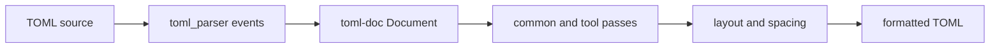

# Contributing to toml-fmt

## Repository layout

The Cargo workspace contains five crates:

- `toml-doc/` provides the mutable, format-preserving TOML document model.
- `common/` provides formatting passes shared by both formatters.
- `tox-rules/` shares tox formatting between `tox.toml` and `[tool.tox]`.
- `pyproject-fmt/` contains the PyO3 implementation for `pyproject-fmt`.
- `tox-toml-fmt/` contains the PyO3 implementation for `tox-toml-fmt`.

Three Python packages provide the command-line layer:

- `toml-fmt-common/` handles argument parsing, file selection, and diff output.
- `pyproject-fmt/` exposes the `pyproject-fmt` command and Python API.
- `tox-toml-fmt/` exposes the `tox-toml-fmt` command and Python API.

The formatter crates keep Rust integration tests in `rust/tests/`. Python tests live in each package's `tests/`
directory. `tasks/` contains repository maintenance scripts.

## Development commands

Use Cargo from the repository root for Rust changes:

```bash
cargo fmt --all
cargo clippy --workspace --all-targets --all-features -- -D warnings
cargo test --workspace --no-default-features
```

The last command disables PyO3's `extension-module` feature so Rust test binaries can link to Python. Test the compiled
extension through tox after changing a formatter crate:

```bash
cd pyproject-fmt
tox run -e 3.14
tox run -e type

cd ../tox-toml-fmt
tox run -e 3.14
tox run -e type
```

Choose an installed Python version if 3.14 is unavailable. Tox skips missing interpreters.

Run the shared Python package in the same way:

```bash
cd toml-fmt-common
tox run -e 3.14
tox run -e type
```

The root formatting environment runs the configured repository checks:

```bash
tox run -e fix
```

## Formatting pipeline

`toml-doc` parses source text into a mutable document while borrowing unchanged text. Formatting passes mutate that
document, and its `Display` implementation writes the result.


```mermaid
flowchart LR
    source[TOML source] --> parser[toml_parser events]
    parser --> document[toml-doc Document]
    document --> passes[common and tool passes]
    passes --> layout[layout and spacing]
    layout --> output[formatted TOML]
```

`Document` stores root entries, sections, and trailing trivia. A section owns its header and entries, which lets table
ordering move the complete unit. A child table after an array-of-tables entry belongs to that array element, so use
`common::sections::reorder_within` instead of sorting `document.sections` directly.

Comments and blank lines lead the item below them. A `Member` stores padding around its value, while its container
writes commas. This split lets array sorting move comments with their values and retain a trailing comma.

Use `Key::segments` when quoted dots matter. `Key::path` joins segments with `.`, so it cannot distinguish `"a.b"` from
`a.b`.

## Common operations

### Visit a table

`common::sections` finds tables regardless of whether the input used headers, dotted keys, or inline tables.

```rust
use common::sections;

sections::for_table_at(document, &["tool".to_owned(), "demo".to_owned()], |table| {
    sections::reorder_inline_table(table, &["name", "version"]);
});
```

Use the public traversal functions instead of indexing sections by hand. The traversal code handles repeated headers,
arrays of tables, and equivalent TOML spellings.

### Rewrite strings

`common::strings::update` decodes a string, applies a transformation, and chooses a valid representation for the new
text.

```rust
use common::strings;

strings::update(value, str::to_lowercase);
```

Use `update_wrapped` when the result may need line continuations.

### Order keys and arrays

```rust
use common::{arrays, sections};

sections::reorder_keys(&mut section.entries, &["", "name", "version"]);
arrays::sort_strings(array, &str::to_lowercase, &str::cmp);
```

An empty string in a key order reserves a slot for unknown keys. A named key also claims its dotted descendants.

For typed inline tables, provide a discriminator and key order:

```rust
use common::sections::{reorder_inline_tables, InlineSchema};

let path = ["tool", "tox"].map(str::to_owned);
reorder_inline_tables(
    document,
    &path,
    &[InlineSchema {
        discriminator: "replace",
        key_order: &["replace", "default", "extend"],
    }],
);
```

The table path limits the schema to its owning tool.

### Build entries

`common::build` creates unspaced entries. The layout pass supplies whitespace later.

```rust
use common::build;

section.entries.push(build::string_entry("name", "example"));
section
    .entries
    .push(build::entry("tags", build::array([build::string("one")])));
```

### Change table shape

```rust
use common::nesting;

nesting::collapse(document, "tool.x");
nesting::expand(document, "tool.x");
```

`collapse_where` leaves selected child tables expanded. The `expand_tables` and `collapse_tables` settings use this
path.

## Tests

Write behavior tests through public APIs. Keep one assertion target per test, parameterize repeated cases, and use
fixtures for shared setup. Mock network, clock, filesystem, or subprocess boundaries; run formatter logic directly.

Formatter output tests use inline `insta` snapshots:

```rust
#[test]
fn a_dependency_list_is_normalized() {
    insta::assert_snapshot!(format("dependencies = ['Demo>=1.0.0']"), @"");
}
```

Populate and review snapshots with:

```bash
cargo insta test --accept
cargo insta review
```

Assertions should cover the complete result. A substring assertion can pass when the formatter leaves the input
unchanged or damages adjacent structure.

Each package enforces 100% coverage. Clear stale instrumentation before measuring Rust coverage:

```bash
cargo llvm-cov clean --workspace
cargo llvm-cov --workspace --no-default-features --summary-only
```

Python tox environments include their package and tests in the coverage report.

## Documentation

Edit files under each package's `docs/` directory. Generate the published README from those sources:

```bash
tox run -e readme -c pyproject-fmt/tox.toml
tox run -e readme -c tox-toml-fmt/tox.toml
```

Build and check links with the package documentation environment:

```bash
tox run -e docs -c pyproject-fmt/tox.toml
tox run -e docs -c tox-toml-fmt/tox.toml
```

## Before committing

Run the checks for each changed layer. A shared Rust change needs the workspace tests and both formatter tox suites. A
documentation change needs both README generation and the affected docs build. Keep commits limited to one concern.
